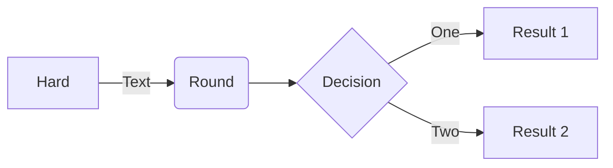
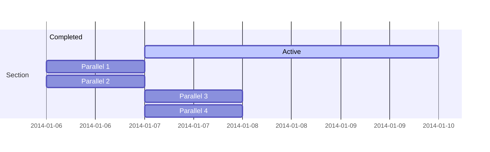
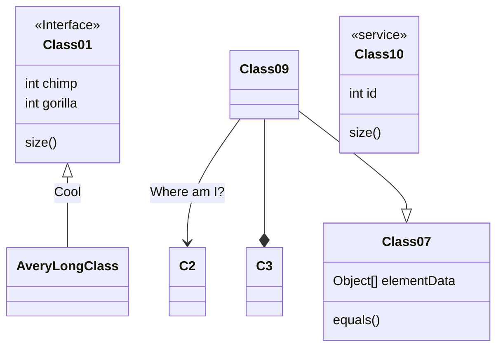
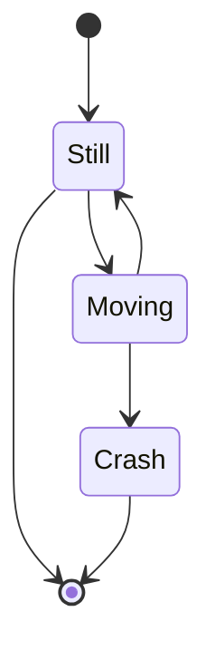
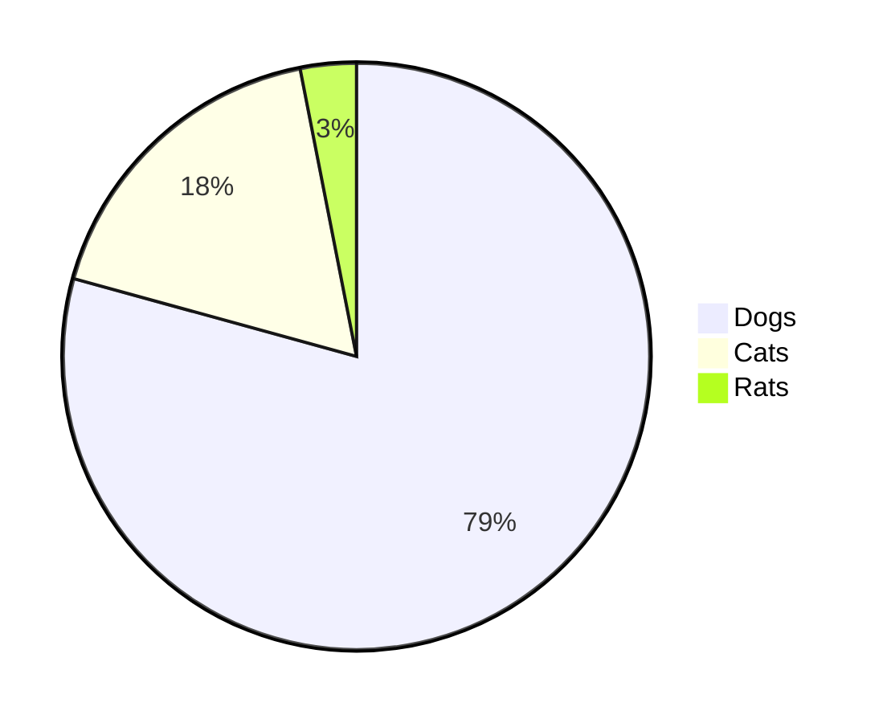
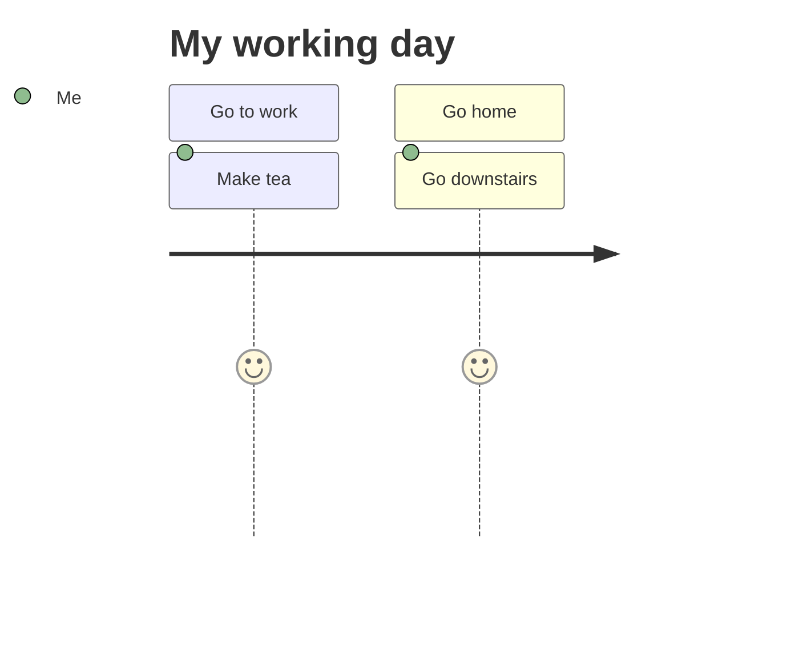
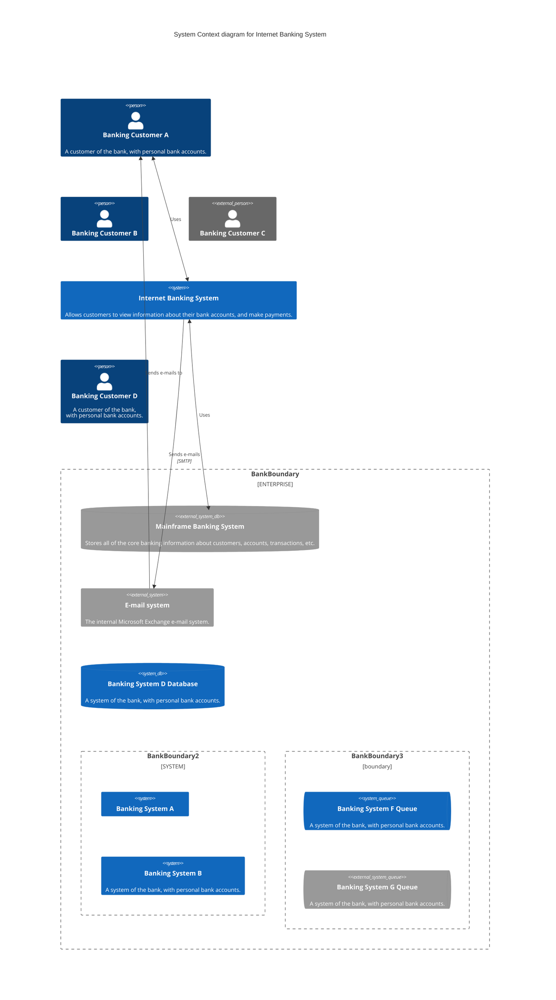

```toc
```


## Heading 2
### Heading 3
#### Heading 4
##### Heading  5
###### Heading 6

## Format

_Italics_
*Italics*
__Bold__
**Bold**
__*Bold Italics*__
**_Bold Italics_**
==highlight==

## Tables

| Column 1 | Column 2 | Column 3 |
|:-------- |:--------:| --------:|
| Left     |  Center  |    Right |
| $x^2$    |  $x^2$   |    $x^3$ |
| Left     |  Center  |    Right |
| Left         | Center          |       Right   |

## Latex

$$\frac{1}{\sqrt{z - \cos{\psi}}} = \frac{\sqrt{2}}{\pi} \sum_{m = -\infty}^{\infty} Q_{m - \frac{1}{2}}(z)e^{im\psi}$$

$$\rho \left (\frac{\partial \mathbf{v}}{\partial t} + \mathbf{v} \cdot \nabla \mathbf{v} \right) = -\nabla p + \nabla \cdot \mathbf{T} + \mathbf{f}$$
$$\mathcal{R}_n (\mathcal{F}) = \mathbb{E}_\varepsilon \left [ \sup_{f \in \mathcal{F}} \frac1n \sum_{i=1}^{n} \varepsilon_i f(x_i)\right]$$
$$
\aleph_0 = \lvert \mathbb{N} \rvert, \mathfrak{c} = \lvert \mathbb{R} \rvert\\
\nexists A : \aleph_0 < \lvert A \rvert < \mathfrak{}
$$

$$
M_r(x_1, x_2, \ldots, x_n) = \begin{cases} 
\left(\frac1n \sum_{i=1}^{n} x_i^{r}\right)^{1/r} & r \neq 0\\
\sqrt[n]{\prod_{i=1}^{n} x} & r = 0
\end{cases}
$$

## Tags

#tag1 #tag2 #tag3

## Footnotes

^74bcda

This line needs some footnote[^1] continuing this tradition, let's add another footnote here[^2]. To insert an automatic footnote press
```
command + shift + 6
```


[^1]: This is the content of the footnote
[^2]: Here's the other footnote

## Internal Links

You can create cool internal links to any file, section or block. Hover over the links in this vault to see what I'm raving about!

- [[Text and Typography]] - Link to whole file!
- [[Text and Typography#Citations]] - Link to citation section
- [[Text and Typography#^93ccbd]] - Link to content in the citations section
- [[Text and Typography#Citations|Citations]] - Link to citations section with custom display tex

## Mermaid Diagrams














## Plugins

### Admonitions

[Link](https://github.com/valentine195/obsidian-admonition)

> [!warning]
> Deprecated, obsidian now has inherant support for admonitions called [Callouts](https://help.obsidian.md/How+to/Use+callouts). If you want to add custom admonitions, install the Admonitions plugin.

Custom content blocks to draw attention! There are many admonition types, use the auto-complete feature to browse through the list. To show a non-collapsable callout do not add anything after the callout tag. Otherwise, add a `+` (`-`) if you want a collapsable admonition that is initially open (closed).

> [!note] 
> Always open

> [!note]+
> Collapsable but initially open

> [!note]-
> Collapsable but initially closed

### Advanced Tables

[Link](https://github.com/tgrosinger/advanced-tables-obsidian)

The advanced tables plugin helps you create tables that can take formular and do much more! To create the table, type the pipe symbol `|` and the first heading and press tab. Repeat this process till all your columns are created. Press `Tab` to move to the next cell. Press `Shift + Tab` to move to the previous cell. Press `Enter` to go to (or create) the next row. 

| Column 1 | Column 2 |
| -------- | -------- |
| Val 1    | Val 2    |
| Val 4    | Val 3    |


You can also open a sidebar that helps control table contents using `Cmd + Shift + D`

### Annotator

The annotator is a pretty cool tool that uses hypothesis to annotate PDFs or ebooks. To annotate a document, create a new file with the following front matter

```yml
---
annotation-target: <path-to-pdf>.pdf
---
```


See file [[Annotation Example]] for a demonstration. To enable and disable annotation, click on the three dots. Use the same procedure to switch to Dark Mode (`Annotator Toggle Dark Mode`). 

### Buttons

[Link](https://github.com/shabegom/buttons)

You can use the quick launcher to create buttons using the "Buttons: Button maker" option. 
```button
name Buttons GitHub Repository
type link
action https://github.com/shabegom/buttons
color default
```

### Calender

[Link](https://github.com/liamcain/obsidian-calendar-plugin)

There are a bunch of calendar plugins. We use the most popular Calendar plugin. The calendar plugin allows you to create daily and weekly notes. To create a note for a day, go to the calendar sidebar and click on the date. The click either opens a note for that day or offers to create a note. 

### Periodic Notes

When using the Periodic Notes plugin, the daily notes get saved to the `Day Planners` folder. 

You can also use the Periodic Notes plugin to create Daily / Weekly / Monthly / Quarterly / Yearly notes that are configured to be stored in the `Planners/{Daily / Weekly / Monthly / Quarterly / Yearly} Planners` directory.

- [[2022-12-19]]
- [[2022-W51]]
- [[2022-12]]
- [[2022-Q4]]
- [[2022]]

### Checklist

- [ ] Here is another TODO
- [ ] Here is yet another TODO
This uses the checklist plugin to list the todos in the right sidebar

### Citations

The citations plugin allows you to cite from a specified library file. For this root folder, the library is a file entitled `references.bib` in the root folder. To specifiy the location of the library, set the path in the settings entitled `Citation database path`. ^93ccbd

You can create a literature notes for each of the papers, the literature notes for this vault gets stored in the `Literature Notes` directory. You can set the path in the setting entitled `Literature note folder`.

You can also cite papers from the library using the following templates

```
[@{{citekey}}]
@{{citekey}}
```

Use `ctrl + shift + e` to cite (an create if not exists) the literature note. Citing the literature note is preferable over the a plain citation so it appears in the graph.

[[@afrati2011optimizing]]
[[@al2011efficient]]

### Custom Frames

Turns webapps into panes using iframes with custom styling! 

The launch commands don't seem to work, but in any case, you can create a pane using the settings. For instance, to create a pane for the Obsidian Forum you can use the following code


```custom-frames
frame: Obsidian Forum
```

Need to research more about this! I believe it's glitchy with Obsidian 1.0. 

> [!missing] 
> Plugin removed! Don't see the utility!

### Dataview

[Link](https://github.com/blacksmithgu/obsidian-dataview)

> [!info] 
> The default template disables the dataview plugin, you can enable the plugin from the settings. The plugin is disabled because it significantly slows down obsidian.

Helps treat your Obsidian vault is database. You can filter, sort and extract data from Markdown pages. Dataview generated data from your vault fro Markdown frontmatter and inline fields

- **Markdown frontmatter** - YAML enclosed by --- at the top of the markdown document
- **Inline fields** - you can write metadata inline using `Key:: Value` format

To demonstrate the utility of the Dataview plugin, we'll use the [[Dataview Demonstration]] file. Note the metadata. There are four ways to query the "database"

1. **Dataview Query Language (DQL)**: A pipeline-ased, vaguely SQL-looking expression language. For instance, the following query extracts information from all files tagged with the #demonstration tag

```dataview
TABLE file.name AS "File", author as "Author" FROM #demonstration
```

2. **Inline Expressions**: You can embed expressions directly in the markdown document. For instance, the following query extracts the name of the file

	ex: The name of this file is `= this.file.name`

3. **Dataview JS** : A JavaScript API that is more powerful the DQL, I probably won't use this
4. **Inline JS Expressions**: Self-explanatory!

### Excalidraw

[Link](https://github.com/zsviczian/obsidian-excalidraw-plugin)

To create a new diagram, use the launcher. The diagram gets created in the `Graphics/Excalidraw`

![[example.excalidraw]]

### Highlightr

To highlight you can use the standard highlight using the following syntax

```
==<text>==
```

==Highlighting this text!==. This default highlight is the accent color. Furthermore, you can use other colors, by left clicking on the text you can choose to highlight using choice of color.

<mark style="background: #FF5582A6;">Text</mark> <mark style="background: #EC008DA6;">Text</mark> <mark style="background: #0D00ECA6;">Text</mark>

### Kanban

You can create a new kanban board from the launcher. For a kanban board example see [[Example Kanban Board]]

### Linter

[Link](https://github.com/platers/obsidian-linter)

Lints the current markdown file. Use quick launcher to lint!

### Longform

Longform allows you to create "projects" essentially. You can split a manuscript into sequential sections called "scenes". You can compile them all to create one document. To create a long form project, pick the directory where you want to create the project. See [[Index]] for an example. 

### Obsidian Git

[Link](https://github.com/denolehov/obsidian-git)

Commands to remotely manage detected git repository. All commands triggered from the launcher!

### Pandoc Reference List

[Link](https://github.com/mgmeyers/obsidian-pandoc-reference-list)

The settings map the `references.bib` file in the settings. Any references make in the document will pop up in the right sidebar. 

### Reminder

[Link](https://github.com/uphy/obsidian-reminder)

You can set reminders for tasks

- [x] This is a task with a reminder (@2022-12-20 03:10) 

Reminder set for 20th December 2022, 2PM. 

> [!info]
> The show reminders feature doesn't seem to be working. Need to test to see if reminders actually work!

### Rollover Daily Todos

[Link](https://github.com/lumoe/obsidian-rollover-daily-todos)

Copies over all incomplete tasks from the last daily note / planner to the current one.  For instance, a daily note for 19th December was created [[2022-12-19]] with a task I don't intend to complete for a long long time! Now, I'll create a daily note for today, [[2022-12-20]], lo and behold! the todo rolled over. 

```ad-info
collapse: open

When using rollovers, the previous tasks will be deleted to conserve the number of TODOs in the checklist. I've explicitly left it in within this section to demonstrate the plugin!
```

### Spaced Repetition

[Link](https://github.com/st3v3nmw/obsidian-spaced-repetition) All hail Anki!

Using flashcards and spaced repetition. You can create decks by corresponding to directory structure or tags. You can use a heirarchy of flashcards using the flashcards tag or folder directory. I'll pick the latter for now. 

the question goes on this side:::answer goes here!
<!--SR:!2022-12-21,1,230-->

the question goes on this side::::answer goes here!
<!--SR:!2022-12-21,1,230!2022-12-21,1,230-->

Front of multiline
?
Backside of multiline card
<!--SR:!2022-12-21,1,230-->

As per the definition
of "multiline" the prompt
can be on multiple lines
?
same goes for
the answer
<!--SR:!2022-12-21,1,230-->

Front of multiline
??
Backside of multiline card
<!--SR:!2022-12-21,1,230!2022-12-21,1,230-->

As per the definition
of "multiline" the prompt
can be on multiple lines
??
same goes for
the answer
<!--SR:!2022-12-21,1,230!2022-12-21,1,230-->


> [!info] 
> Made a few aesthetic changes to the plugin, the font was HUGE! I changed the font-size in the `#sr-flashcard-view` class to a different variable (`font-size: var(--font-adaptive-normal);`). The class looks like
> ```css
> #sr-flashcard-view {
> 	font-size: var(--font-adaptive-normal);
> 	overflow-y: auto;
> 	height: 80%;
> }
> ```

### Style Settings

You can tinker with the theme in the style settings! For instance, the theme I use is the Things theme but using the "True Black" background style. 

### Table Extended

[Link](https://github.com/aidenlx/table-extended)

Allows for more complex table operators like merging cells. This plugin is incompatible with [[Text and Typography#Advanced Tables]]. To create these extended tables, you need to add 

```md
-tx-
```

at the begining of the table.


-tx-
|             |          Grouping           || 
First Header  | Second Header | Third Header | 
 ------------ | :-----------: | -----------: | 
Content       |          *Long Cell*        || 
Content       |   **Cell**    |         Cell | 
New section   |     More      |         Data | 
And more      | With an escaped '\|'       || 
[Prototype Table Heading]

### Templatr

[Link](https://github.com/SilentVoid13/Templater)

> [!todo]
> Fill out this section, looks like it'll need longer!

## Explore

- OpenGate - [Link](https://github.com/nguyenvanduocit/obsidian-open-gate)
- GPT-3 Notes - [Link](https://github.com/micahke/obsidian-gpt3-notes)
- Obsidian Paper Import - [Link]()


