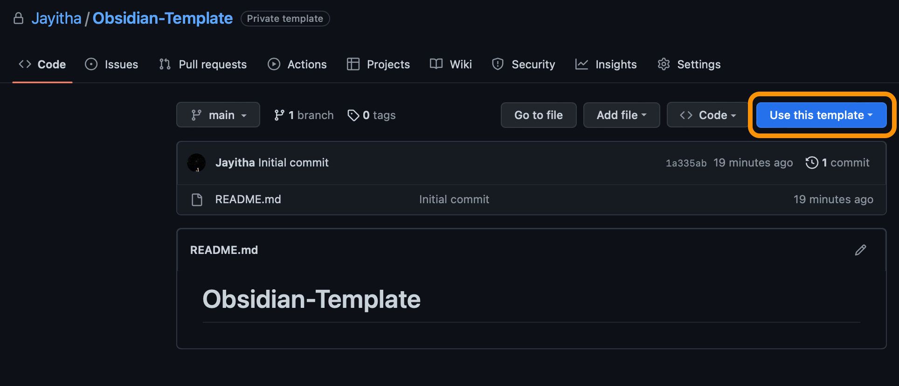

# Obsidian-Template

To use this template, click on "Use this template" on the Github repository



Once you have the repo cloned, add the following to the `.gitignore` file to ensure you don't have to keep updating it. To be honest, you could probably leave it. 

```
.obsidian
Examples
```

The template looks like so


## Changes

20-12-2022: Added Buttons plugin

## Todo

- [ ] Ugh typos!
- [ ] Image captions
- [ ] Make the `.obsidian` and related files updatable as a gitmodule
- [ ] Investigate print format of file.tasks
- [ ] Make annotator dark mode darker
- [x] Create day notes in a specific directory - ==Used Periodic Notes template==
- [ ] Figure out how to use templates for planner notes [[Text and Typography#Periodic Notes]]
- [ ] Figure out how to add URLs to frontmatter to format literature notes [[Text and Typography#Citations]]
- [ ] How can I set a preamble file for the latex
- [x] Using Admonitions!
- [x] Do reminders actually work?
- [x] Don't show rolled over todos [[Text and Typography#Rollover Daily Todos]] - ==Fixed by deleting todo from previous day==
- [ ] [[Text and Typography#Templatr]]
- [ ] How to also use standard templates
- [ ] How to nest tags?
- [ ] How to use pandoc to generate a super good-looking latex document?
- [ ] Remove "Open today's daily note" option from left sidebar